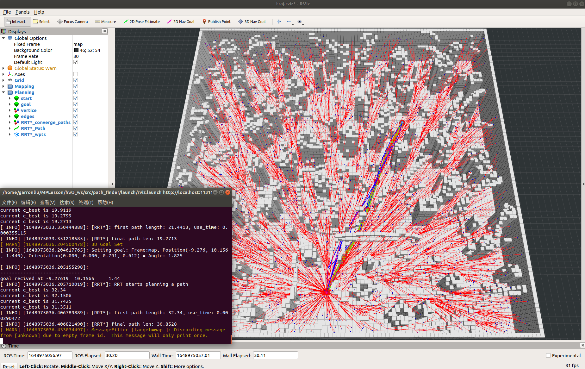
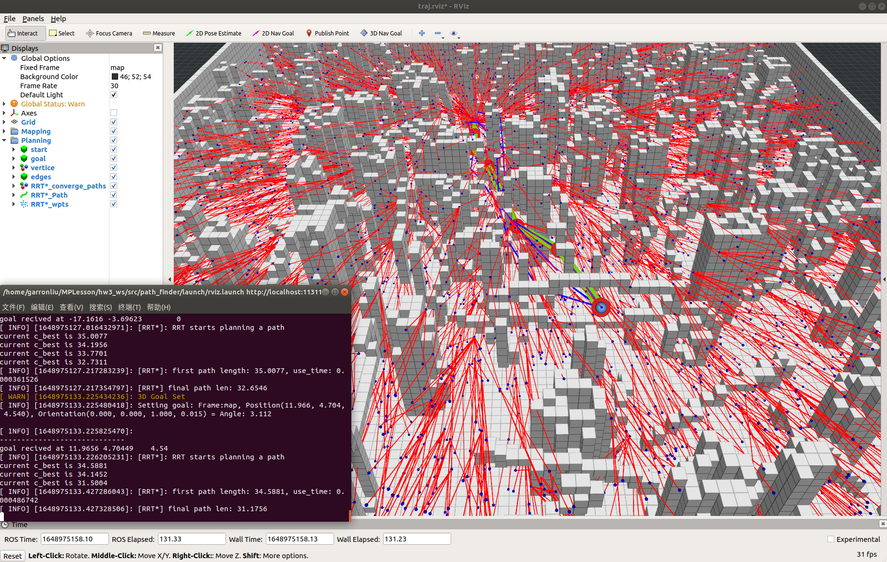
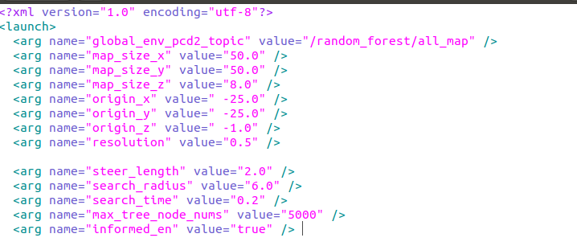
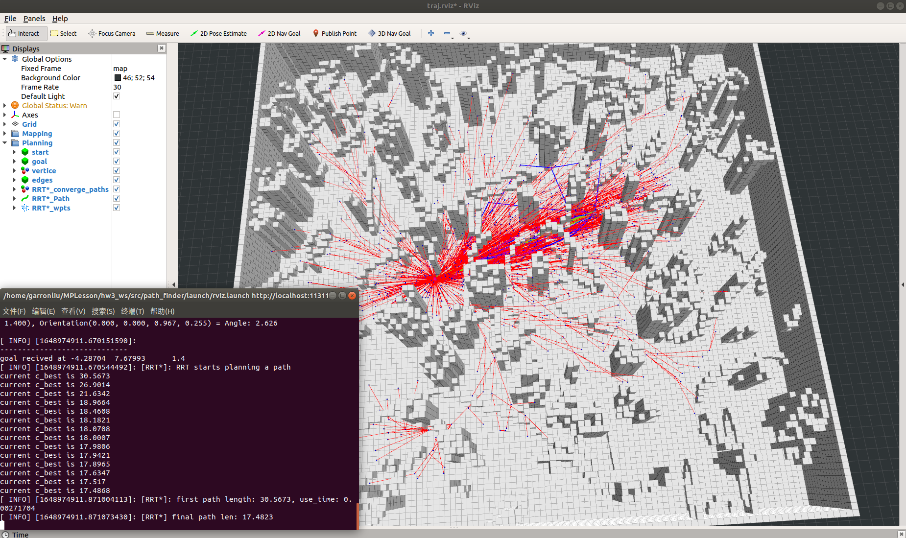
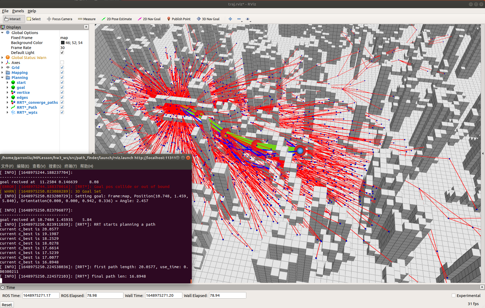
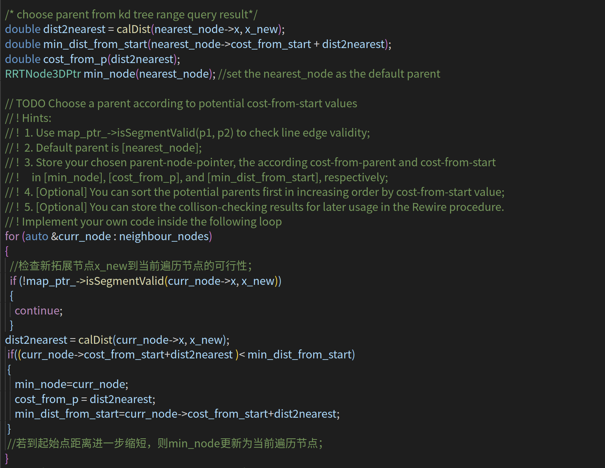
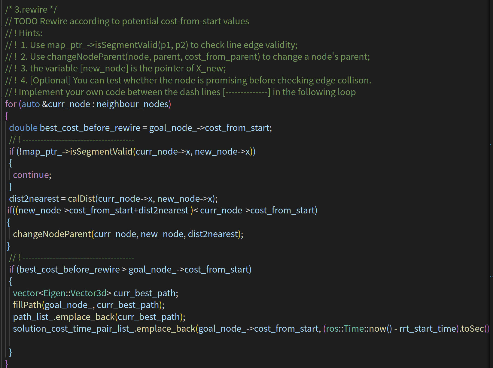
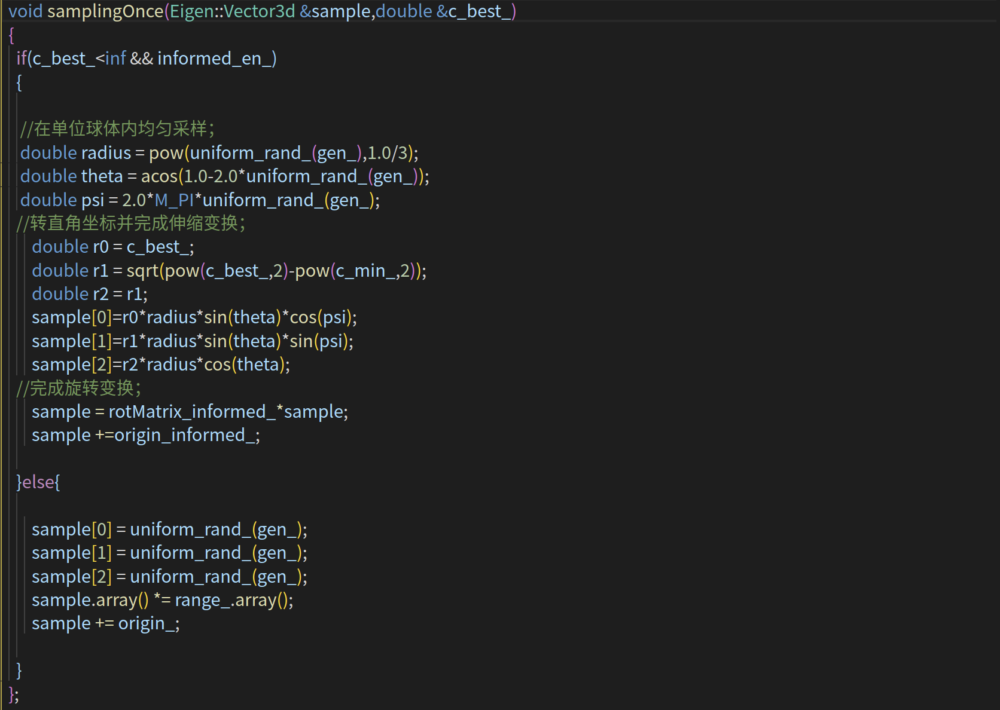

# Motion Planning Homework 3

深蓝学院《移动机器人运动规划》第九期，第三周课程作业。该代码实现了RRT*和informed RRT*算法。
---

# Compile

使用以下指令下载和编译代码：
    
```
mkdir -p ~/MPLesson_ws/src
cd ~/MPLesson_ws/src
git clone https://github.com/GarronLiu/Motion_Planning_Hw3.git
cd ..
catkin_make
```

# Run the Package

```
cd ~/MPLesson_ws 
source devel/setup.bash
roslaunch path_finder rviz.launch 
```
点击3D Nav Goal在地图中选取起点和目标点即可开始规划。

# Result

## RRT* Result

RRT*的搜索结果
<p align='center'>
    
    
</p>

## Informed RRT* Result

```
cd ~/MPLesson_ws/src/path_finder/launch
gedit test_planners.launch 
```
<p align='center'>
    
</p>
修改informed_en为true，表示以用informed RRT*的采样功能。结果如下：

<p align='center'>
    
    
</p>
可见路径节点采样范围被限制在一个三维椭圆体内

# Main code change

## 重新选择父节点代码

<p align='center'>
    
</p>

## 重布线随机树过程

<p align='center'>
    
</p>

## 三维椭圆体内均匀采样

<p align='center'>
    
</p>

单位球体内均匀采样公式：

<p align='center'>
    
</p>
ξ_i 服从单位均匀分布。

